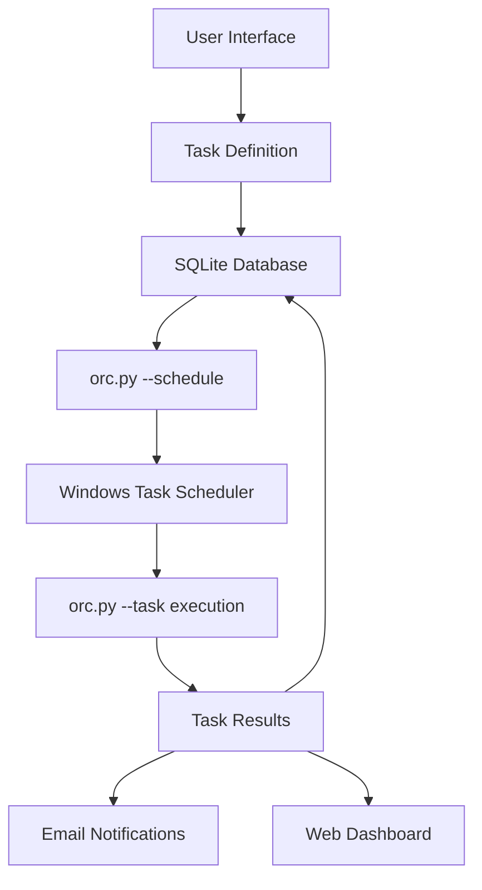

# Task Python Orchestrator

**Enterprise-grade task scheduling and monitoring system for Windows environments**

> A local-only, secure task orchestration platform that bridges Python automation with Windows Task Scheduler, designed for SMBs requiring robust data pipeline automation without complex infrastructure.

## 🎯 Project Goals

- **Local-First**: Zero cloud dependencies, complete data sovereignty
- **Enterprise Security**: Encrypted credential storage, no plaintext secrets
- **Multi-Interface**: CLI, Web UI, and interactive modes for different use cases
- **Production Ready**: Comprehensive logging, error handling, retry logic
- **Windows Native**: Deep integration with Windows Task Scheduler for reliability
- **Developer Friendly**: Modular architecture, extensive testing, clear APIs

## 🏗️ Architecture Overview

### Core Components

```
📦 orchestrator/
├── 🧠 core/                    # Core business logic
│   ├── config_manager.py       # SQLite + encryption
│   ├── scheduler.py            # Task scheduling coordinator
│   └── task_result.py          # Execution result dataclass
├── 🔧 utils/                   # Platform utilities
│   ├── windows_scheduler.py    # schtasks.exe wrapper
│   ├── cron_converter.py       # Cron → Windows scheduler
│   └── configure.py            # Configuration wizard
├── 🌐 web/                     # Web interface
│   ├── app.py                  # Flask application
│   ├── dashboard.py            # Dashboard entry point
│   └── api/routes.py           # REST API endpoints
└── 🔄 legacy/                  # Compatibility layer
    └── task_manager.py         # Legacy execution engine
```

### Data Flow



## 🚀 Key Features

### ✅ Task Management
- **Multi-Interface Creation**: Web UI, CLI, interactive mode
- **Flexible Scheduling**: Cron expressions converted to Windows scheduler
- **Dependency Resolution**: Task prerequisites and condition checking
- **Retry Logic**: Configurable retry count and delays
- **Timeout Protection**: Prevent runaway processes

### 🔒 Security & Reliability
- **Encrypted Storage**: Fernet encryption for credentials (AES-128, PBKDF2)
- **No Hardcoded Secrets**: All sensitive data encrypted in SQLite
- **Audit Trail**: Complete execution history and logging
- **Error Isolation**: Failed tasks don't affect system stability

### 📊 Monitoring & Notifications
- **Real-time Dashboard**: Live task status and execution history
- **Email Alerts**: Immediate failure notifications
- **Daily Reports**: HTML summary reports with metrics
- **Execution Logs**: Detailed logging with rotation

### 🔧 Developer Experience
- **Multiple CLIs**: `orc.py` (core), `main.py` (interactive), `orchestrator.cli` (advanced)
- **REST API**: Full CRUD operations for tasks
- **Test Suite**: Comprehensive unit and integration tests
- **Type Hints**: Full type coverage for better IDE support

## 🎛️ Interfaces & Usage

### 1. Interactive Mode (Recommended for Beginners)
```bash
python main.py
```
- Menu-driven task creation
- Built-in validation and help
- Automatic scheduling integration

### 2. Core CLI (Production Use)
```bash
# Schedule a task
python orc.py --schedule my_data_job

# Execute task (called by Windows)
python orc.py --task my_data_job

# List scheduled tasks
python orc.py --list

# Update existing task
python orc.py --update my_task --new-schedule "*/30 * * * *"
```

### 3. Advanced CLI
```bash
# Full orchestrator CLI
python -m orchestrator.cli schedule --task my_job
python -m orchestrator.cli execute --task my_job
python -m orchestrator.cli dashboard
```

### 4. Web Dashboard
```bash
python -m orchestrator.web.dashboard
# Access: http://localhost:5000
```

**Dashboard Features:**
- 📊 Real-time task status grid
- 📈 Execution history and trends  
- 🎛️ Task management (create, edit, delete)
- 📋 Quick task scheduler
- 🔄 Manual task execution
- 📱 Responsive design with dark/light themes

### 5. REST API
```bash
# Start API server
python -m flask --app orchestrator.web.app run

# Create task
curl -X POST http://localhost:5000/api/tasks \
  -H "Content-Type: application/json" \
  -d '{"name": "my_task", "type": "data_job", "command": "python script.py", "schedule": "0 6 * * *"}'
```

## 🔄 Task Lifecycle

### 1. **Definition Phase**
```python
# Via API or UI
task = {
    "name": "daily_report",
    "type": "data_job", 
    "command": "python scripts/generate_report.py",
    "schedule": "0 6 * * *",  # Daily at 6 AM
    "timeout": 3600,
    "retry_count": 3,
    "dependencies": ["vpn_check"],
    "enabled": True
}
```

### 2. **Scheduling Phase**
```bash
# Creates Windows scheduled task
python orc.py --schedule daily_report
```

### 3. **Execution Phase**
- Windows Task Scheduler triggers: `orc.py --task daily_report`
- Task executes with full error handling
- Results saved to SQLite database
- Notifications sent based on outcome

### 4. **Monitoring Phase**
- Real-time status via web dashboard
- Email notifications for failures
- Daily HTML summary reports
- Execution history and trends

## 📋 Task Configuration

### Task Types
- **`data_job`**: Data processing and ETL tasks
- **`condition`**: Prerequisite checks (VPN, file existence)
- **`report`**: Report generation and distribution
- **`maintenance`**: System maintenance and cleanup

### Schedule Formats

**Cron Expressions:**
```bash
"0 6 * * *"     # Daily at 6 AM
"0 8 * * 1"     # Weekly Monday at 8 AM  
"0 9 1 * *"     # Monthly 1st day at 9 AM
"*/30 * * * *"  # Every 30 minutes
```

**Windows-Style (New):**
```bash
"06:00"         # Daily at 6:00 AM
"MON 08:00"     # Weekly Monday at 8:00 AM
"15 09:30"      # Monthly 15th at 9:30 AM
```

### Dependencies

```python
# Task dependencies
"dependencies": [
    "vpn_check",           # Wait for VPN connection
    "file:/path/to/file",  # Wait for file existence
    "url:https://api.com/health",  # Wait for API health
    "command:ping -c 1 server"     # Wait for command success
]
```

## 🔧 Configuration & Setup

### Initial Setup
```bash
# Install dependencies
pip install -r requirements.txt

# Run setup wizard
python setup.py

# Test configuration
python test_setup.py

# Start orchestrator
python main.py
```

### Database Configuration
- **Location**: `data/orchestrator.db` (SQLite)
- **Encryption**: Fernet (AES-128) with PBKDF2 key derivation
- **Schema**: Tasks, credentials, config, execution history
- **Management**: Built-in DBeaver integration

### Email Configuration
```python
# Via setup wizard or programmatically
config_manager.store_credential('email_username', 'user@company.com')
config_manager.store_credential('email_password', 'app_password')
config_manager.store_config('email', 'smtp_server', 'smtp.office365.com')
config_manager.store_config('email', 'recipients', '["admin@company.com"]')
```

## 🧪 Testing & Validation

### Automated Testing
```bash
# Run full test suite
python -m pytest tests/

# Test specific components
python -m pytest tests/test_scheduler.py
python -m pytest tests/test_web_integration.py
```

### Task Simulation
```bash
# Simulate complete task lifecycle
python tools/task_simulator.py

# Test existing task updates
python tools/task_simulator.py --use-existing my_task --update-schedule "*/5 * * * *"

# Keep task for debugging
python tools/task_simulator.py --keep-task
```

### Manual Validation
```bash
# Debug task creation
python tools/task_creation_debugger.py

# Check system health
python -c "from orchestrator.core.config_manager import ConfigManager; print('OK')"
```

## 📁 File Structure

```
task-python-orchestrator/
├── 📂 orchestrator/           # Main package
│   ├── 📂 core/              # Core business logic
│   ├── 📂 utils/             # Utilities and helpers
│   ├── 📂 web/               # Web interface
│   └── 📂 legacy/            # Compatibility layer
├── 📂 scripts/               # User scripts and utilities
│   ├── 📂 checks/            # Condition checking scripts
│   └── 📂 notifications/     # Email notification scripts
├── 📂 templates/             # Web UI templates
├── 📂 tests/                 # Test suite
├── 📂 tools/                 # Development and debugging tools
├── 📂 data/                  # SQLite database (created on first run)
├── 📂 logs/                  # Execution logs (created on first run)
├── 📄 main.py               # Interactive entry point
├── 📄 orc.py                # Core orchestrator CLI
├── 📄 setup.py              # Initial configuration
└── 📄 requirements.txt      # Python dependencies
```

## 🔧 Advanced Features

### Custom Scripts Integration
```python
# Add custom condition check
def check_custom_condition():
    # Your logic here
    return True  # or False

# Register as dependency
task_dependencies = ["custom_condition_script.py"]
```

### Email Templates
- **Immediate Alerts**: Plain text notifications for failures
- **Daily Reports**: Rich HTML reports with metrics and trends
- **Custom Recipients**: Different notification groups per task type

### VPN Detection
```python
# Cross-platform VPN detection
def check_vpn_connection():
    # Windows: Check TAP/VPN interfaces
    # macOS: Check utun/ppp interfaces  
    # Linux: Check tun/ppp interfaces
    # DNS: Resolve internal domains
    return vpn_status
```

### Performance Monitoring
- Task execution timing and trends
- System resource usage tracking
- Failed task analysis and reporting
- Automatic retry optimization

## 🚨 Troubleshooting

### Common Issues

**Database locked errors:**
```bash
# Check for zombie processes
ps aux | grep python
# Kill if needed, then restart
```

**Windows Task Scheduler failures:**
```bash
# Check task exists
schtasks /query /tn "\Orchestrator\Orc_my_task"

# Debug with task debugger
python tools/task_creation_debugger.py
```

**Permission issues:**
- Run as Administrator for initial setup
- Check Windows Task Scheduler permissions
- Verify Python executable path

### Logging and Debugging
```bash
# Enable debug logging
export LOG_LEVEL=DEBUG
python orchestrator.py

# Check specific log files
tail -f logs/orchestrator_20250619.log

# Database debugging
python -c "from orchestrator.core.config_manager import ConfigManager; cm = ConfigManager(); print(cm.get_all_tasks())"
```

## 🔮 Future Roadmap

### Planned Features
- **Multi-node Support**: Distributed task execution
- **Resource Limits**: CPU/memory constraints per task  
- **Advanced Scheduling**: Calendar-based schedules, exclusion dates
- **Metrics Export**: Prometheus/Grafana integration
- **Plugin System**: Custom task types and integrations
- **Mobile Dashboard**: PWA for mobile monitoring

### Integration Opportunities
- **CI/CD Pipelines**: Jenkins, GitHub Actions integration
- **Cloud Storage**: Azure Blob, AWS S3 connectors
- **Databases**: PostgreSQL, SQL Server, Oracle drivers
- **APIs**: REST/GraphQL client generators
- **Message Queues**: RabbitMQ, Apache Kafka support

## 📚 Best Practices

### Task Design
- Keep tasks idempotent and atomic
- Use meaningful names and descriptions
- Set appropriate timeouts and retry policies
- Implement proper error handling in scripts
- Use dependencies for complex workflows

### Security
- Never hardcode credentials in scripts
- Use encrypted storage for all secrets
- Regularly rotate API keys and passwords
- Monitor failed login attempts
- Backup encrypted database regularly

### Performance
- Monitor task execution times
- Use appropriate retry delays
- Avoid overlapping executions
- Clean up old logs and data
- Monitor system resources

---

**Version**: 1.0.0  
**Last Updated**: 2025-06-19  
**Python Compatibility**: 3.11+  
**Platform**: Windows 10/11, Windows Server 2019+  
**License**: MIT